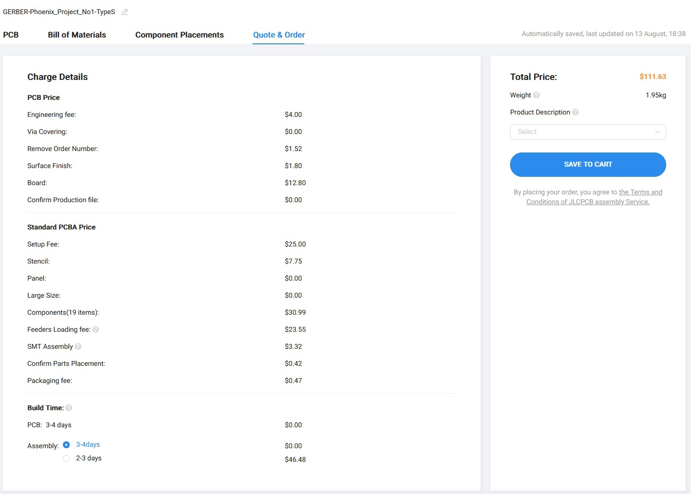

# JLCPCB ordering guidelines

The information below is aimed at helping users not familiar to PCB design and/or manufacturing to easily order Type S or Type H PCBs at JLCPCB.

JLCPCB already provides generic infornmation on how to order PCBs and assemble them, you'll find this information on the links below:
* https://jlcpcb.com/help/article/54-How-do-I-place-an-order
* https://jlcpcb.com/help/article/342-how-do-i-place-a-pcba-order

As for ordering FR4 plates, either full or half, the process is even simpler as there is no assembly process.  
In this case follow the same steps up to ***Advanced Options***.  
For the ***PCB Specifications*** section you can leave all options by default and just select the PCB color you want.

## Connecting to JLCPCB website

Go to https://jlcpcb.com website.

Click on *'Sign in'*, if you do not have an account it is time to create one by selecting *'New Customer? Start Here'*.

Once you are logged, you should see your user account displayed on the top right.

## Starting a new order

To start click on the *'Instant Quote'* button

You'll then have the following information displayed.

## Upload gerber file

Click on *'Add gerger file'* and select one of those files:
* **production_files/typeH/jlcpcb/GERBER-Phoenix_Project_No1-TypeH.zip** for the Type H PCB
* **production_files/typeS/jlcpcb/GERBER-Phoenix_Project_No1-TypeS.zip** for the Type S PCB

Wait a bit while the file is processed, to have the following information displayed:

PCB dimensions are automatically calculated and a price is already given with all defauts options.
In this section we will leave all the default parameters as is, with the exception of *'PCB Qty'* if you want to order more than 5 PCBs.

## Tweaking PCB Specifications

By default you will have the following parameters:

It is perfectly fine to keep them as is to have a working PCB, but will do a few tweaks.

I strongly recommend selecting *'LeadFree HASL'*:
* Go lead free, it is more environmentally friendly.
* It adds only 1.80$ to the cost of 5 PCB compared to default *'HASL(with lead)'*.
* *'ENIG'* adds 18.70$, a significant expense not justified in this case as no gold will be visible after soldering.

I selected *'Black'* for the PCB color(I love the satin finish of their black soldermask) but you can pick any color you want.  
If you select *'White'* the silkscreen color will then be black. 

## Tweaking High-spec Options

By default you will have the following parameters:

I removed the order number to have this:

Keep in mind that it adds 1.52$ to remove the order number.  
You can perfectly keep the option *'Remove Order Number'* to *'No'*, JLCPCB will automatically place this number on the PCB were it is the most appropriate, and will most probably place it on the cutout tabs that will later be snapped off(but no warranty on that).

## Advanced Options

No need to touch that.

## Tweaking PCB Assenbly

In this section:

Click the slide button on the right to open the following page:

We will change a few options here:

### PCBA Type

It must be set to *'Standard'* in order for:
* The WS2812 mini leds to be soldered.
* The Kailh hotswap sockets to be soldered.

### Assembly Side

We select *'Bottom Side'* as it is were all our components are placed.

### PCBA Qty

If you want to save some money you can select down to 2, but keep in mind that you will still have 5 PCBs manufactured if you ordered 5 for example, 3 of them will be shipped unpopulated.
The price difference may not be significent enough to have only 2 assembled PCBs though...

### Edge Rails/Fiducials

We select *'Added by customer'* as everything is prepared on the PCB design.

### Confirm Parts Placements

I'd suggest selecting *'Yes'*.  

I previously selected *'No'* as JLCPCB usually manage this part correctly and if they have any doubts they will contact you for confirmation.  
I have been contacted previously for the WS2812 mini leds and had to explain what to do for the placement and later confirm that their placement screenshot was correct.    

If you select *'Yes'* this will force you to manually confirm components placement before the PCBs are assembled.
They will probably come back to you anyway for the leds placement and maybe also for the Kailh hotswap sockets.
This is a bit cumbersome for non PCB designers but definitely doable and will allow you to check that no mistakes have been made.
I'll give more details on parts placement confirmation later on in this document. 

### Confirm parameters

Click on *'Confirm'* button when it is done, the following page appears:

### BOM and CPL files

Click on *'NEXT'*, the folowing page appears:

Click *'Add BOM File'* and select one of those files:
* **production_files/typeH/jlcpcb/BOM-Phoenix_Project_No1-TypeH.csv** for the Type H PCB
* **production_files/typeS/jlcpcb/BOM-Phoenix_Project_No1-TypeS.csv** for the Type S PCB

Click *'Add CPL File'* and select one of those files:
* **production_files/typeH/jlcpcb/CPL-Phoenix_Project_No1-TypeH.csv** for the Type H PCB
* **production_files/typeS/jlcpcb/CPL-Phoenix_Project_No1-TypeS.csv** for the Type S PCB

You should have the follwing page displayed:

Click on *'Process BOM & CPL'*

## Bill of Material page

This page shows something interesting as there is currently an inventory shortage for one component.
This can happen often as JLCPCB tend to wait that inventories are empty before ordering new components.  

You have two solutions.

1. Play the waiting game until all components are available to make an order.
2. Find a replacement for those components.

Solution 1 is the easiest and less risky one.

But solution 2 is not as compilcated as you may think, particularly for simple passive components like capacitors, resistors, diodes and fuses.  
In this case this the reference of a resettable fuse in an imperial 805 footprint, we could hope to easily find an equivalent in stock replacement.    
If you click on the search icon of this component, immediately on the left of the *'Qty'* column, the website will propose you several alternatives that should be compatible, like below.

The list shows possible choices, all 805 footprint, from the closest match possible to the least. The first choice is the reference we had already selected but out of stock, the next two ones are also out of stock, but the fourth one is in stock and a pretty good match so this is the one I selected for my order.

After clicking *'NEXT'* the website will compute a PCB assembly preview for you.  
Depending on the server load this can take some time, don't hesitate to refresh the page (F5) if it take too long.  
You should be greated with the following visual (I pressed the *'Bottom'* button at the top to show the bottom assembly).

Don't put much of an importance on the components placement and orientation, this display has not real value and it is advertised as is.  
Components can be wrongly oriented and even in the wrong position (can even be outside the PCB area) although I have to admit that JLCPCB have made significant progress since they proposed their PCBA service.  
People at JLCPCB will inspect the data and correct everything wrong and in case of doubt they will contact you for clarification (or if you asked for a placement review before going to assembly).  

You can click *'NEXT'* as soon as this page is displayed, this will go to the quote and order page.

## Quote & Order

You aleady have a price here, not including shipping costs and taxes, here it is 112$ for 5 fully assembled PCBs so around 23$ per PCB.  
For assembled PCBs you have to declare it's purpose in the *'Product Description'* drop down menu.  

I selected DIY for the description here.

Just click *'SAVE TO CART'* and you are mostly done, except for shipping selection and payment.

## About WS2812 mini polarity and placement

This is specific polarity information to correctly place WS2812 mini leds onto the PCB.
Those leds are designed in the BOM as D1 to D16.

Please be aware that the triangle cutout of the WS2812 mini led is not indicating pin 1, but pin 3 of the chip.
The WS2812 mini footprint indicates pin 1 on the silkscreen with a dot, diametrically opposite of pin 3 indicated by the triangle cutout.

See image below for a visual explanation:

In case you asked for manually inspecting the component placement before fabrication this is a good reference for you to inspect that this component is correcty placed.  
If JLCPCB ask you how to place this component you can just copy paste the previous text section with the image for explanation.

