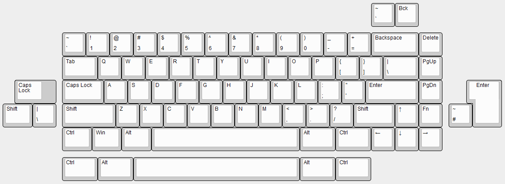
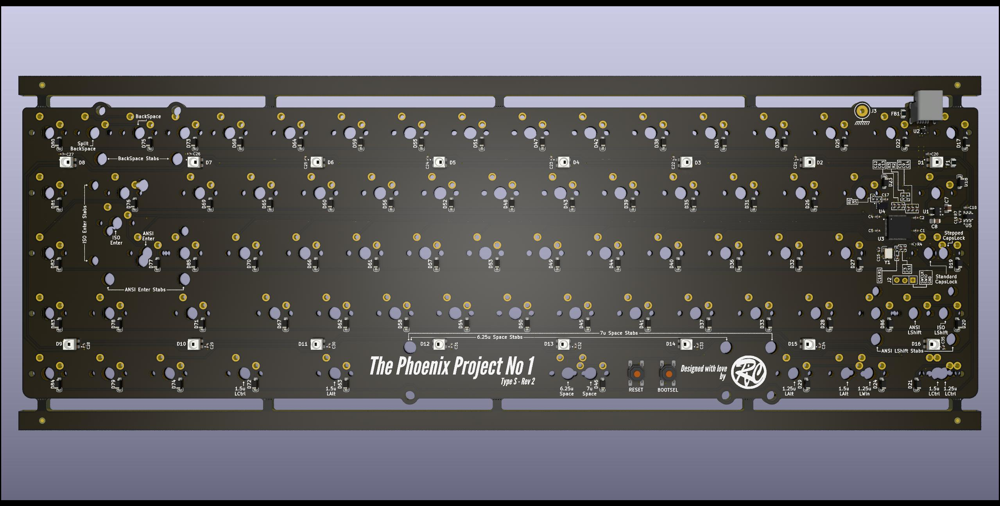
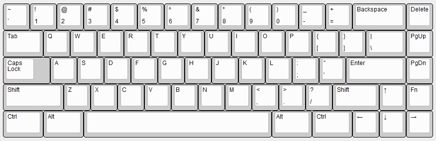
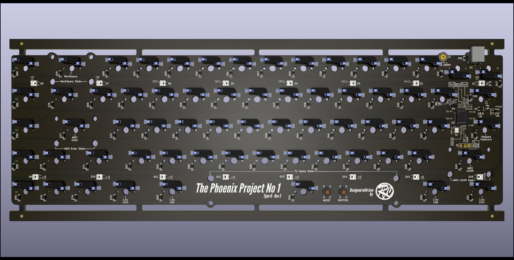
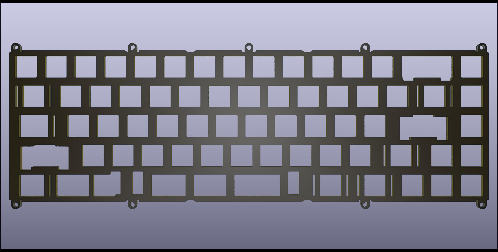
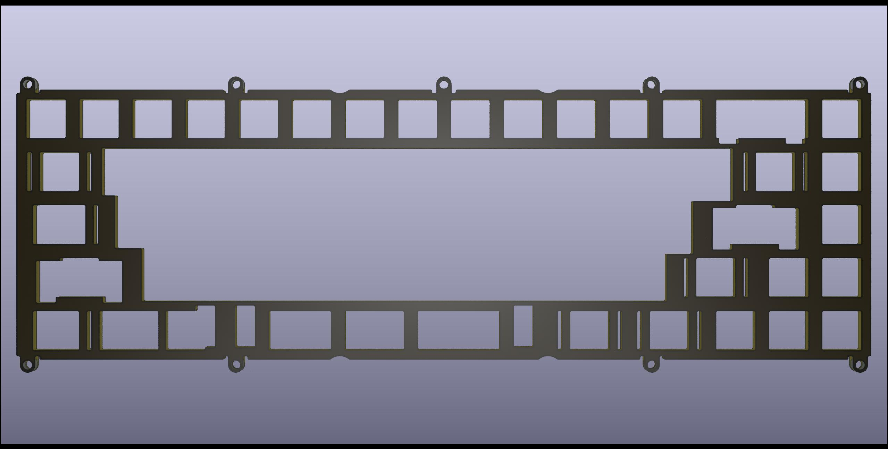

# The Phoenix Project No 1

The Phoenix Project No 1 is a collection of replacement PCBs and plates for the M65-A keyboard.
## The Phoenix Project initiative

The goal of this initiative is to help revive our old beloved customs.  

While the cases are often manufactured in sturdy metal and designed to last decades the provided PCB can fail for various reasons, rendering your nice keyboard pretty much useless as an input device.  
If a defacto standard PCB is used like in some 60% or TKL boards you could purchase an off the shelf replacement made by renowned PCB designers like Hiney or Wilba.  
But if the PCB is custom made for the board and dies, good luck to find a replacement...  

This initiative tries to solve this problem by providing an open source replacement PCB with a permissive licence so that anyone could manufacture and/or sell them if they want.

After all, we've already seen open source projects revive old legendary keyboards like Model F and Beamspring, why not our customs ?
## Licence

This project is using the permissive [Creative Commons Attribution-ShareAlike 4.0 International License (CC BY-SA)](https://creativecommons.org/licenses/by-sa/4.0/) licence.  
This licence will allow you to use this project, even commercially, as long as you give credit to the project creator (me, Rico of mymakercorner) and publish under the same licence the modifications you may make.
### 3D models

One 3D model file has been taken from SnapEDA website.  
It is using the [Creative Commons Attribution-ShareAlike 4.0 International License (CC BY-SA)](https://creativecommons.org/licenses/by-sa/4.0/)  with the [Design Exception 1.0 licence](https://www.snapeda.com/about/FAQ/#designexception).  
The file is Kailh_PG151101S11.step  

The other 3D models have been created by me:
* HRO-U-M-M5DD-W-1.step (USB Mini housing)
* USON8_3x2.step (QSPI flash storage)
* WS2812B-Mini.step (WS2812B Mini addressage led)  

You are welcomed to use them in your own projects as long as you give credit for my work(like I did for the Kailh hotswap socket 3D model)!
## Use at your own risks

All this work is provided for free without any warranty.  
By using this material you agree that I will not be liable for any problem you may have.
## PCBs

Type S and Type H variants are available.  
They are electrically compatible and share the same firmware.
### Type S

This is the solder version of the PCB, able to accomodate various layouts:
* ANSI/ISO
* Normal/split Backspace
* Normal/split LShift
* Normal/stepped CapsLock
* 6.25U Spacebar Winkey
* 7U Spacebar Winkeyless

### Type H

This is the hotswap version of the PCB.  
Only one layout is available, but the selected one is not often found on a hotswap PCB and may please people that often go the solder route to have it.

### Features

* RP2040 MCU
* 2MB of flash memory
* Double BOOTSEL/RESET push buttons
* ESD protection for USB data lines and VBUS
* Overcurrent protection by using a resettable fuse
* EMI protection by using a ferrite bead
* Additional grounding and ESD protection using a cable soldered to PCB and screwed to case.
## Plates

While original M65-A plates should be compatible with the PCBs, new and more modern plates have been designed.  
The newly designed plates uses small mount tabs instead of the large mounts used on the original plate. Also those mounts tabs are not placed on all available mount holes of the case, allowing for a more flexy experience, and particularly the mount hole under the space bar  is not used.  
No meme cuts are added, most are only small cuts near bigger than 1U keys. The exception is for the spacebar that has large cut holes to normalize it's sound a bit compared to the alphas.  
All PCB layouts are supported with the exception of ISO; I'd prefer to design specific ISO plates in the future than to have this big L-shaped hole on the plates.  

For the moment full and half plates are available for ANSI layouts with the following formats:
* DXF
* Gerber production file for FR4 plate fabrication (tested at JLCPCB).
* Kicad 6.x project files for FR4 plates design.
### Full plate

### Half plate

## Repository content
### kicad_projects
* **typeS** *(kicad 6.x project for the Phoenix Project No 1 Type S PCB)* 
* **typeH** *(kicad 6.x project for the Phoenix Project No 1 Type H PCB)*
* **full_plate_ansi** *(kicad 6.x project for the full plate PCB)*
* **half_plate_ansi** *(kicad 6.x project for the half plate PCB)*
### qmk_vial_firmware_binary
* **phoenix_project_no1_vial.uf2** *(QMK/VIAL firmware binary for both Type S and Type H PCBs)* 

### production_file
* **typeS**
    * **bom** *(interactive BOM)*
    * **jlcpcb** *(gerber, CPL and BOM files)*
* **typeH**
    * **bom** *(interactive BOM)*
    * **jlcpcb** *(gerber, CPL and BOM files)*
* **full_plate_ansi**
    * **bom** *(interactive BOM)*
    * **jlcpcb** *(gerber, CPL and BOM files)*
    * **full_plate_ansi.dxf** *(DXF file for laser cutting services)*
* **half_plate_ansi**
    * **bom** *(interactive BOM)*
    * **jlcpcb** *(gerber, CPL and BOM files)*
    * **half_plate_ansi.dxf** *(DXF file for laser cutting services)*

## General information

### Send PCB for manufacturing/assembly at JLCPCB

Please find information on how to order fully assembled Type H or Type S PCBs [here](JLCPCB_ordering.md)

### Reset and flashing procedures

SOON!!!

### Grounding cable specification and usage

SOON!!!

